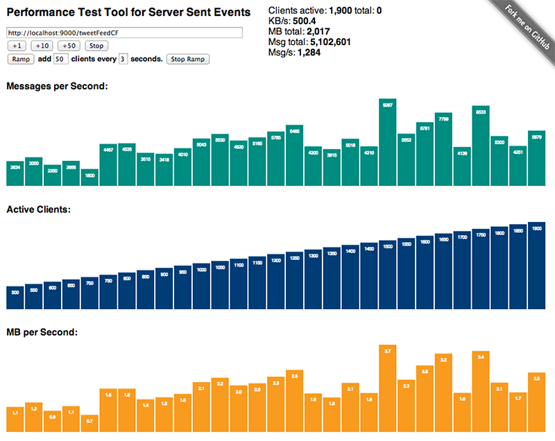

#sse-perf  

This is a web application using **[Play Framework](http://www.playframework.com)** for load testing **[Server Sent Events (SSE)](http://dev.w3.org/html5/eventsource/)** streams. It will establish concurrent connections to a server and measure and display the combined throughput and number of chunks received per second. The results will then be shown using animated bar charts. Ramping can be used to add a specified amount of additional connections at the specified time interval.

Internally, **[Akka](http://akka.io)** actors are used to handle the connections and Concurrent.broadcast from **[Play Iteratee API](http://www.playframework.com/documentation/2.1.1/Iteratees)** is used to deliver the information into the **[Server Sent Events (SSE)](http://dev.w3.org/html5/eventsource/)** stream.

You can **[see this application in action](http:birdwatch.matthiasnehlsen.com:9001)**. I use it to put a constant load of a few hundred concurrent client connections on my **[BirdWatch](http:birdwatch.matthiasnehlsen.com)** application.

Please **[Check out my Blog](http://matthiasnehlsen.com/blog/2013/05/11/load-testing-server-sent-event-streams/)** for more information about this project.
 
###Setup
There is not much to the setup if you have a working installation of **[Play Framework](http://www.playframework.com)** on your computer. All you need to do is **play run** in your shell or **play "run 9001"** for example if you are already using port 9000 for the application you want to test. Then you need to open **http://localhost:9001**, or whatever port you chose for this application.

## Licence

Licensed under the Apache License, Version 2.0 (the "License"); you may not use this project except in compliance with the License. You may obtain a copy of the License at http://www.apache.org/licenses/LICENSE-2.0.

Unless required by applicable law or agreed to in writing, software distributed under the License is distributed on an "AS IS" BASIS, WITHOUT WARRANTIES OR CONDITIONS OF ANY KIND, either express or implied. See the License for the specific language governing permissions and limitations under the License.

Copyright &copy; 2013 **[Matthias Nehlsen](http://www.matthiasnehlsen.com)**.
